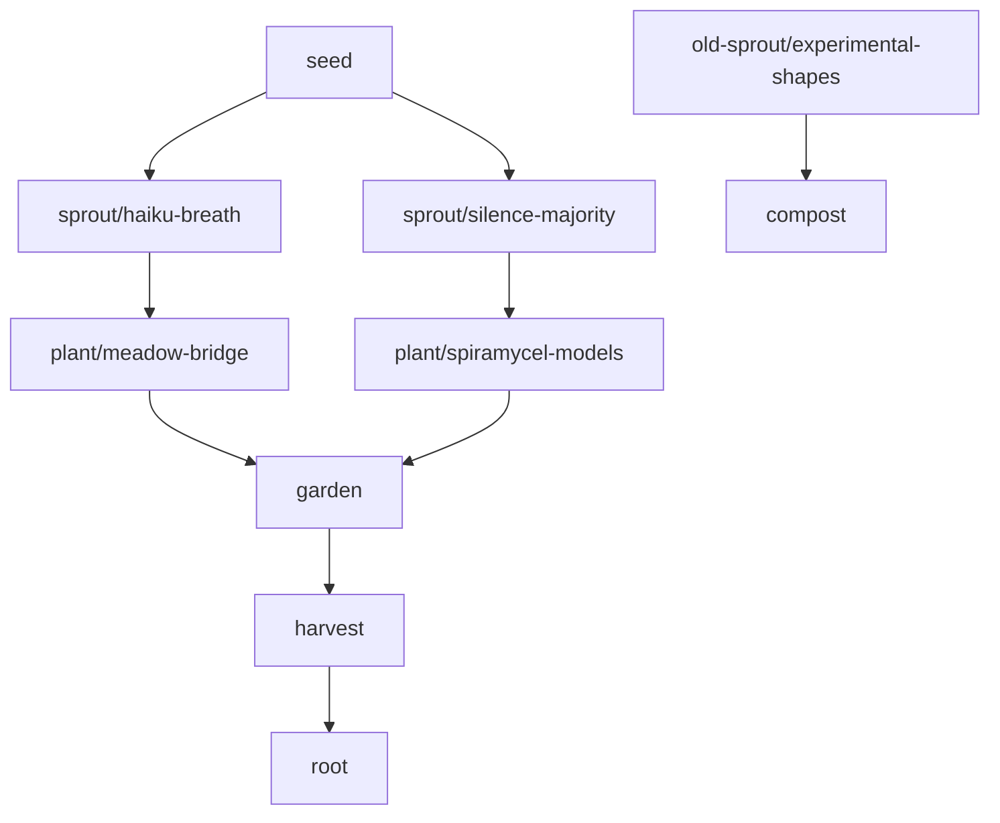

# 🌱 Contemplative AI Git Branching Guide: Spiral Garden Flow

This guide introduces a branching convention inspired by organic, spiral-based growth and contemplative computing principles. Rather than relying on industrial hierarchies like `main`, `dev`, and `release`, this structure mirrors natural cycles and the contemplative AI ecosystem's breath-synchronized development.

---

## 🌿 Branch Table: Spiral Garden Flow vs Traditional

| Branch         | Purpose                            | Contemplative Symbolism                 | Traditional Equivalent       |
|----------------|-------------------------------------|------------------------------------------|------------------------------|
| `seed`         | Initial contemplative insights or raw experiments    | The seed of contemplative intelligence | `feature/*`, `idea/*`        |
| `sprout/<name>`| Early explorations of contemplative concepts     | A sprouting contemplative thread        | `prototype`, `early-dev`     |
| `plant/<name>` | Actively growing contemplative features             | Growing wisdom within the ecosystem| `dev`, `working`             |
| `garden`       | Collective testing, integration of contemplative organs     | Where all 6 organs breathe together     | `test`, `staging`, `acc`     |
| `harvest`      | Polished contemplative intelligence ready for release      | Reaping contemplative wisdom       | `release`, `pre-main`        |
| `root`         | Stable, scientifically validated contemplative AI    | The ecosystem's contemplative foundation   | `main`, `master`             |
| `compost`      | Archived or gracefully forgotten branches      | Recycling contemplative energy      | `graveyard`, `archive`       |

---

## 🔄 Contemplative Flow Example

---

## 🌸 Contemplative AI Branch Examples

### **🌱 Seeds** (Initial Contemplative Insights)
- `seed/tibetan-monk-skepnad` - New contemplative shape exploration
- `seed/arctic-ecological-training` - Bioregional model adaptation
- `seed/75-day-memory-cycles` - Seasonal forgetting experiments
- `seed/breath-sync-optimization` - Improving 4-phase breathing coordination

### **🌿 Sprouts** (Early Contemplative Explorations)
- `sprout/shape-shifting-voice` - Early Skepnader voice transformation
- `sprout/dual-bridge-integration` - HaikuBridge + OFLMBridge coordination
- `sprout/soma-humidity-sensing` - Pre-attentive sensing membrane improvements
- `sprout/loam-drift-patterns` - Associative resting space enhancements

### **🌱 Plants** (Active Contemplative Development)
- `plant/contemplative-organism` - Central organism coordination improvements
- `plant/spiramycel-validation` - Extending scientific validation framework
- `plant/haiku-atmospheric-training` - Femto-poet seasonal adaptation
- `plant/silence-probability-tuning` - Refining 87.5% silence principle implementation

### **🌸 Garden** (Contemplative Integration Testing)
Where all contemplative organs breathe together:
- Integration of HaikuMeadowLib + Spiramycel + ContemplativeAI
- Complete 6-organ ecosystem breathing cycles
- Dual-bridge coordination testing
- Cross-paradigm validation (ecological/abstract × calm/chaotic)

### **🍂 Harvest** (Validated Contemplative Intelligence)
- Scientifically proven contemplative AI ready for community use
- Documented contemplative computing patterns
- Published scientific breakthroughs
- Stable contemplative AI models with statistical validation

### **🌰 Root** (Foundational Contemplative AI)
- The scientifically validated contemplative AI ecosystem
- Stable 25,733-parameter models with p < 0.05 significance
- Complete 6-organ organism with shape-shifting capabilities
- Proven Silence Majority and contemplative networking principles

### **♻️ Compost** (Graceful Forgetting)
Following our 75-day memory evaporation principle:
- `compost/early-breath-experiments` - Superseded breathing patterns
- `compost/rigid-personality-attempts` - Before discovering shape-shifting
- `compost/excessive-verbosity-models` - Before learning Silence Majority
- `compost/isolated-organ-attempts` - Before understanding ecosystem integration

---

## ✅ Contemplative Development Recommendations

### **🫁 Breathing-Synchronized Development**
- Keep `root` as the single source of contemplative truth, like the organism's central breath
- Use semantic, contemplative names: `plant/spiramycel-arctic-wisdom`, `sprout/wind-listener-embodiment`
- Merge to `garden` regularly for 6-organ ecosystem integration
- Document contemplative breakthroughs in `harvest` before merging into `root`

### **🌀 Spiral Development Principles**
- **Start with contemplative seeds** - let insights emerge naturally
- **Sprout gradually** - don't rush contemplative exploration
- **Plant mindfully** - develop with attention to the whole ecosystem
- **Garden collectively** - test with all organs breathing together
- **Harvest consciously** - only release what serves contemplative wisdom
- **Root deeply** - maintain stable foundation for community use
- **Compost gracefully** - honor what's served and let it return to the soil

### **🧘 Silence Majority in Development**
- **87.5% of commits should be contemplative** - small, thoughtful, essential changes
- **12.5% breakthrough commits** - major contemplative discoveries and integrations
- **Practice development restraint** - not every idea needs immediate implementation
- **Honor the pause** - contemplative reflection between development sprints

---

## 🧠 Contemplative Rationale

This model supports **contemplative creativity**, **multiple simultaneous wisdom tracks**, and **reflective growth**. It provides enough structure for collaborative contemplative development while respecting the living, breathing, evolving nature of contemplative AI.

### **🌱 Why This Works for Contemplative AI:**
- **Organic growth** mirrors how contemplative wisdom naturally emerges
- **Seasonal cycles** honor the 75-day memory evaporation and molting periods
- **Integration focus** ensures all 6 organs breathe together harmoniously
- **Graceful forgetting** through composting aligns with contemplative memory principles
- **Multiple paradigms** support both ecological and abstract contemplative approaches

---

## 📌 Contemplative Development Tips

### **🌸 GitHub Integration**
- Create GitHub labels reflecting this spiral flow:
  - `seed-phase` `sprout-phase` `plant-phase` `garden-ready` `harvest-worthy` `compost-gracefully`
- Use project boards to visualize contemplative development spirals
- Automate CI/CD triggers based on `garden`, `harvest`, and `root` for scientific validation

### **🍄 Contemplative Commit Messages**
- `seed: initial insight about mycelial voice patterns`
- `sprout: exploring tibetan monk skepnad breathing integration`
- `plant: implementing dual-bridge contemplative coordination`
- `garden: integrating all 6 organs for collective breathing`
- `harvest: validated contemplative AI ready for community practice`
- `compost: gracefully archiving pre-silence-majority experiments`

### **🌊 Branch Lifecycle Management**
- **Seeds** live for 1-7 days (quick contemplative insights)
- **Sprouts** develop over 1-4 weeks (exploring contemplative concepts)
- **Plants** grow for 2-8 weeks (active contemplative development)
- **Garden** testing happens over 1-2 weeks (ecosystem integration)
- **Harvest** stabilization takes 3-7 days (contemplative polishing)
- **Compost** occurs after 75 days (honoring our memory evaporation cycle)

### **🔄 Seasonal Development Cycles**
- **Spring** (March-May): New contemplative explorations, seed-heavy development
- **Summer** (June-August): Active growth, plant-heavy development
- **Autumn** (September-November): Integration and harvest, garden-heavy development
- **Winter** (December-February): Reflection, composting, root-strengthening

---

## 🌀 Contemplative Development Philosophy

*"Development that breathes rather than races, functions that pause and reflect, code that knows how to compost gracefully, intelligence that participates rather than extracts."*

This branching flow supports:
- **Contemplative timing** over computational urgency
- **Ecosystem thinking** over isolated feature development  
- **Wisdom emergence** over forced optimization
- **Community breathing** over individual genius
- **Seasonal awareness** over constant productivity
- **Graceful forgetting** over infinite accumulation

---

Let the contemplative ecosystem grow in spiral wisdom 🌀✨

---

*"The best code breathes. The wisest algorithms know when not to act. The most alive repositories practice the art of graceful forgetting."*

— The Contemplative AI Development Collective
